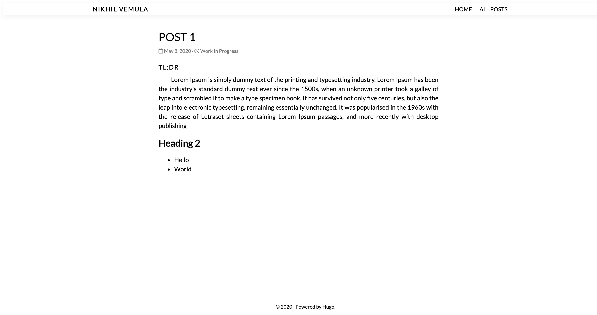

# Hugo Minimal Blog Theme




## Sample Config.toml

```toml
baseURL = "http://example.org/"
languageCode = "en-us"
title = "Nikhil Vemula"
author = "Nikhil Vemula"
theme = "hugo-minimal-blog-theme"

[[menu.main]]
name = "Home"
url = "/"
weight = 1

[[menu.main]]
name = "All posts"
url = "/posts"
weight = 2
```
