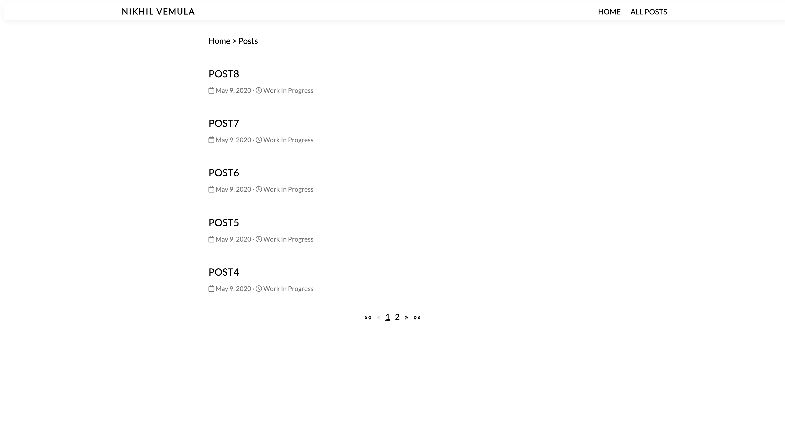

# Hugo Minimal Blog Theme

## Home


## All Posts



## Single Post


## Sample Config.toml

```toml
baseURL = "http://example.org/"
languageCode = "en-us"
title = "Nikhil Vemula"
theme = "hugo-minimal-blog-theme"
pygmentsUseClasses=true
paginate = 5

[author]
  name = "Nikhil Vemula"
  title = "Application Developer"
  subtitle = "Coder by :heart:"


[[params.social]]
  name = "github"
  icon = "fab fa-github-square"
  url = "https://github.com/nikhil-vemula"

[[params.social]]
  name = "twitter"
  icon = "fab fa-twitter-square"
  url = "https://github.com/nikhil-vemula"

[[params.social]]
  name = "facebook"
  icon = "fab fa-facebook-square"
  url = "https://github.com/nikhil-vemula"

[[params.social]]
  name = "linkedin"
  icon = "fab fa-linkedin"
  url = "https://github.com/nikhil-vemula"

[[menu.main]]
name = "Home"
url = "/"
weight = 1

[[menu.main]]
name = "All posts"
url = "/posts"
weight = 2
```
